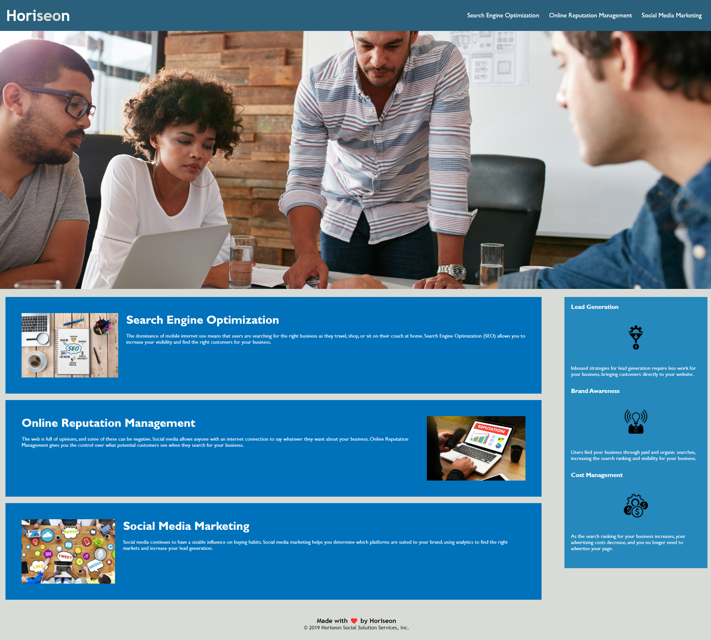

# Horiseon Code Refactor

## Description

This project is a code refactor for the Horiseon website homepage. The purposes of this refactoring is to make the companies website efficient and accessible. This refactoring should also result in improved search engine optimization. The modification does not change the displayed styling of the page.

## Tasks completed
    -Redundant classes were consolidated
    -Semantic HTML elements added
    -Alt text was added to images
    -Explanatory comments were provided in the HTML document
    -CSS was reorganized to follow a logical structure
    -Comments added to the CSS file
    -A descriptive title was added

## Links

github account https://github.com/DKILGORE79/ch1-code-refactor

https://dkilgore79.github.io/ch1-code-refactor/

## Installation

not applicable

## Usage

Once deployed the application can be viewed in a traditional desktop web browser.

## Credits

tutorials and recourses used
 - https://www.w3schools.com/html/html5_semantic_elements.asp
 - https://developer.mozilla.org/en-US/docs/Web/HTML
 - https://coding-boot-camp.github.io/full-stack/github/professional-readme-guide
 - https://blog.hubspot.com/marketing/jump-link-same-page

## License

MIT License

Copyright (c) [2022] [Derek Kilgore]

Permission is hereby granted, free of charge, to any person obtaining a copy
of this software and associated documentation files (the "Software"), to deal
in the Software without restriction, including without limitation the rights
to use, copy, modify, merge, publish, distribute, sublicense, and/or sell
copies of the Software, and to permit persons to whom the Software is
furnished to do so, subject to the following conditions:

The above copyright notice and this permission notice shall be included in all
copies or substantial portions of the Software.

THE SOFTWARE IS PROVIDED "AS IS", WITHOUT WARRANTY OF ANY KIND, EXPRESS OR
IMPLIED, INCLUDING BUT NOT LIMITED TO THE WARRANTIES OF MERCHANTABILITY,
FITNESS FOR A PARTICULAR PURPOSE AND NONINFRINGEMENT. IN NO EVENT SHALL THE
AUTHORS OR COPYRIGHT HOLDERS BE LIABLE FOR ANY CLAIM, DAMAGES OR OTHER
LIABILITY, WHETHER IN AN ACTION OF CONTRACT, TORT OR OTHERWISE, ARISING FROM,
OUT OF OR IN CONNECTION WITH THE SOFTWARE OR THE USE OR OTHER DEALINGS IN THE
SOFTWARE.

---

